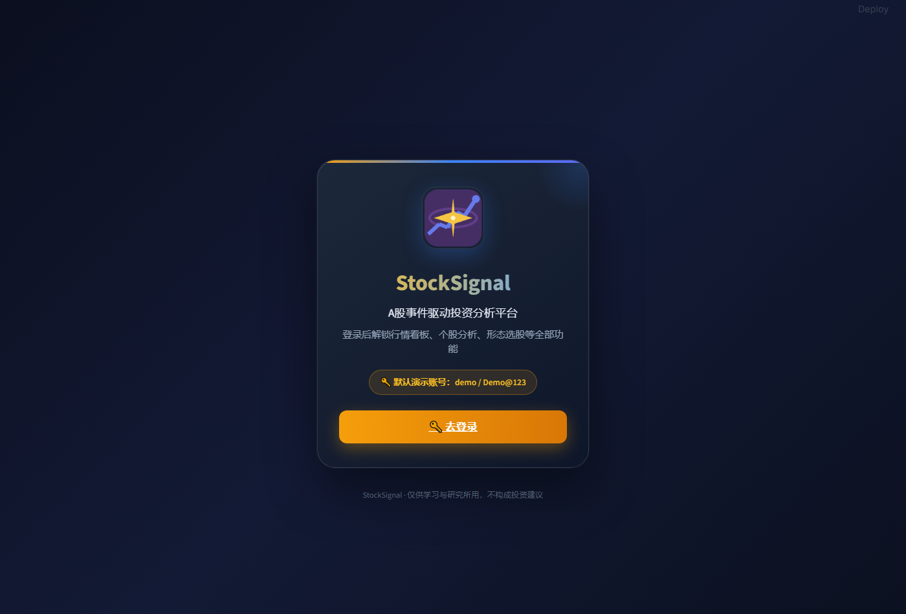
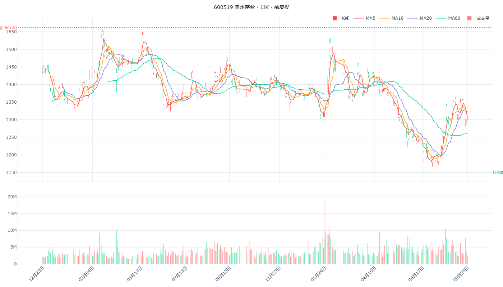
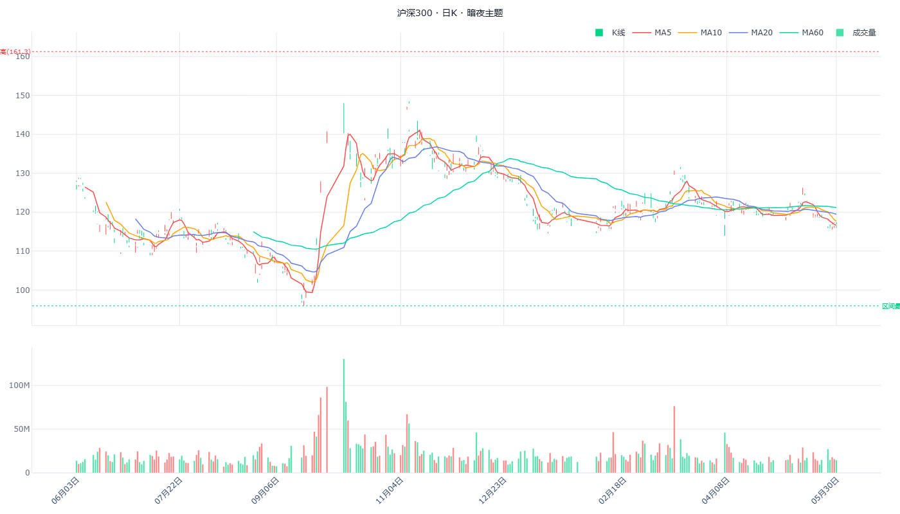
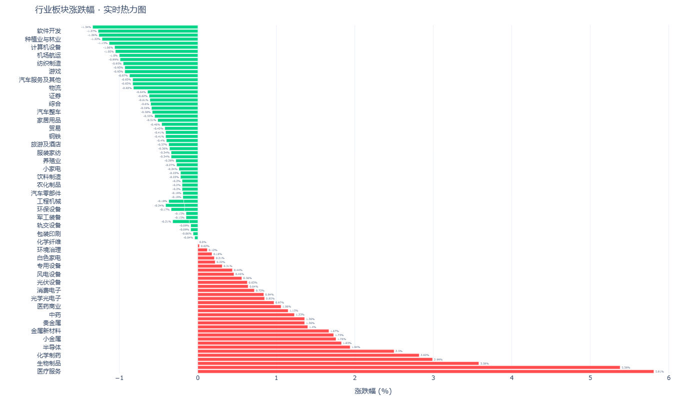
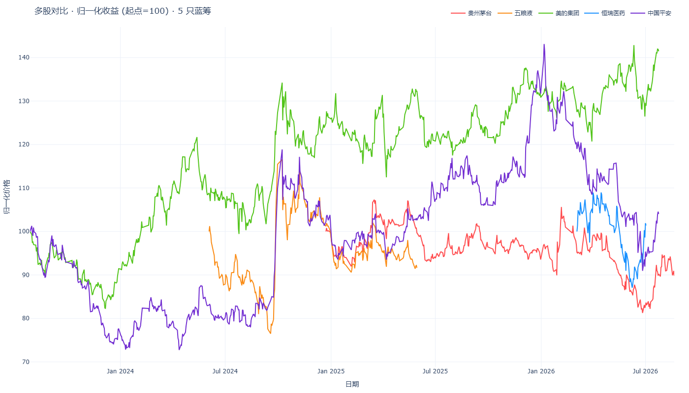
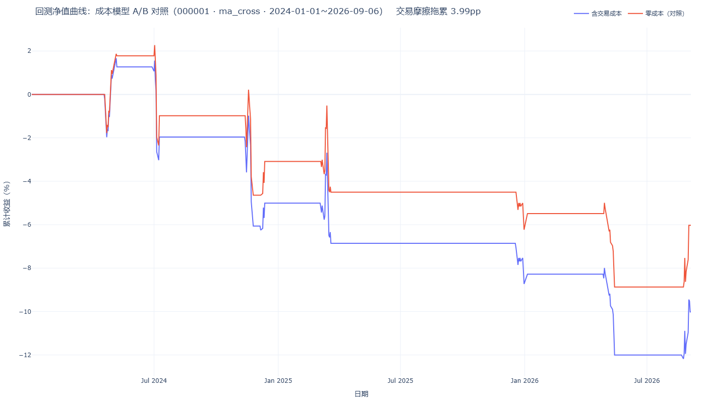

<div align="center">

# 📈 StockSignal · A股事件驱动投资分析平台

**开源 · 免费 · 多数据源自动降级 · 开箱即用**

[](https://www.python.org/)
[](https://streamlit.io/)
[](https://flask.palletsprojects.com/)
[](https://akshare.akfamily.xyz/)
[](https://github.com/hzzqq/StockSignal)
[]()

> **把「事件 → 主线 → 回测 → 交易」串成一个工作台的 A 股分析平台。**
> 不依赖任何券商接口，聚合 4 大免费数据源 + 本地 SQLite 缓存，
> 38 个功能页面开箱即用——从行情看板到事件追踪，从策略回测到模拟交易。

⭐ **如果你觉得有用，点个 Star，或者直接提 Issue —— 每一条反馈都是这个项目活下去的氧气。** ⭐

</div>

---

## ✨ 为什么值得你花 2 分钟

| 你关心的 | StockSignal 给的 |
|---|---|
| 🧭 **数据源会不会挂** | AKShare → BaoStock → 新浪 → 东方财富 → 本地缓存，**4 级自动降级**，单点故障不崩、断网也能看历史 |
| 📊 **功能全不全** | **38 个功能页面**：行情看板 / 个股分析 / 多股对比 / 事件追踪 / 策略回测 / 智能选股 / 资金流向 / 市场情绪 / 模拟交易 / 智能条件单…… |
| 🧪 **靠不靠谱** | **1767 个自动化测试**（含数据正确性断言、页面冒烟、后端安全回归），每个页面都有测试兜底 |
| 🎨 **好不好用** | 暗夜 / 白天双主题，A 股红涨绿跌，K 线支持日/周/月切换 + 十字光标 + 双击弹分时 |
| 🚀 **跑起来难不难** | Windows 双击 `.bat` 一键启动；Docker Compose 一条命令；手动启动 5 行命令 |

---

## 📸 界面一览

| 模块 | 截图 |
|---|---|
| 🪐 登录页（深色 + 紫蓝渐变） |  |
| 📈 行情看板 · 茅台日K + 4 均线 + 量能（亮色） |  |
| 🌙 暗夜主题 · 沪深300 日K（starfield_dark） |  |
| 🔥 行业板块涨跌热力图 |  |
| 📊 多股对比 · 5 只蓝筹归一化收益 |  |
| 📉 策略回测 · 收益曲线 vs 沪深300 |  |

> 截图均由 `scripts/gen_screenshots.py` 从 SQLite 缓存真实数据 + 真实 visualizer 代码导出（与页面渲染 1:1 等价）。本地跑 `python scripts/gen_screenshots.py` 即可重生。

---

## 🚀 快速开始（复制即跑）

### 方式 A：Windows 一键启动 ⭐ 推荐

```bash
# 1) 克隆
git clone https://github.com/hzzqq/StockSignal.git
cd StockSignal

# 2) 双击 启动StockSignal.bat
#    脚本自动：检查 Python → 建虚拟环境 → 初始化数据库 → 启动后端(5050)+前端(8899) → 打开浏览器
```

### 方式 B：手动分步（macOS / Linux / Windows 通用）

```bash
# 1) 创建虚拟环境
python -m venv venv
source venv/bin/activate        # Windows: venv\Scripts\activate

# 2) 安装依赖（前端 + 后端两处都要装！）
pip install -r requirements.txt
pip install -r backend/requirements.txt

# 3) 初始化数据库（建表 + admin/demo 种子账号）
python -m backend.scripts.init_db

# 4) 终端 1：启动 Flask 后端（端口 5050）
python -m flask --app backend.app:app run --host 127.0.0.1 --port 5050

# 5) 终端 2：启动 Streamlit 前端（端口 8899）
streamlit run app.py --server.port 8899 --server.headless true
```

浏览器打开 **http://localhost:8899** 🎉

### 方式 C：Docker

```bash
docker compose -f docker-compose.yml up --build
# 前端 http://localhost:8899   后端 http://localhost:5050
```

### 👤 默认账号（仅本地开发）

| 用户名 | 密码 | 角色 |
|---|---|---|
| `demo` | `Demo@123` | 普通用户（体验全部功能） |
| `admin` | `Admin@123` | 管理员（用户管理 / 系统配置 / 操作日志） |

---

## 🧭 功能地图（38 个页面）

### 📊 行情与分析
- **行情看板** — K 线（日/周/月切换、十字光标、双击弹分时、区域缩放）+ 技术面四大维度（趋势/动量/量能/形态）+ 板块涨跌榜
- **个股分析** — 个股全维度拆解（K 线、技术面、财务、资金、新闻情绪）
- **多股对比** — 一次对比 ≥5 只标的的走势 / 收益 / 相关性
- **智能选股 / 形态选股** — 多策略筛选 + K 线形态扫描
- **ETF 筛选** — 场内 ETF 多维筛选

### 📰 事件驱动（项目核心）
- **事件追踪** — 政策 / 并购 / 涨价 / 公告等催化事件聚合，利好利空标注（利空标 K 线下方）
- **每日晨报** — 一键生成当日市场简报
- **市场驱动力 / 板块轮动** — 找主线、看轮动节奏
- **股吧热帖** — 舆情与情绪面

### 💰 资金与情绪
- **资金流向** — 主力 / 北向 / 板块资金
- **市场情绪 / 市场强弱** — 情绪指标（ADL / ADR / PE / 股息率 / 涨停数）+ 市场温度
- **财报日历 / 基本面分析** — 业绩披露日历 + 财务三表

### 🧪 策略与交易
- **策略回测** — Backtrader 引擎，含佣金万三 / 印花税千一 / 滑点成本（对强势上涨股也覆盖）
- **模拟交易** — 无风险练手，虚拟资金跟单体验
- **智能条件单 / 价格预警 / 智能盯盘** — 价格、异动、自定义策略盯盘
- **实盘交易** — 手动记录真实持仓与盈亏

### 🤖 AI 与辅助
- **星辰 AI · 多市场智能股票分析师** — 全局侧边栏 AI 咨询，持续对话
- **QuantAgent 投研** — 量化研究助手
- **新手教程 / 数据导出 / 用户管理 / 系统配置**

---

## 🏗 系统架构

```
┌──────────────────────────────┐         ┌───────────────────────────────┐
│   Streamlit 多页前端 (8899)   │  HTTP   │   Flask 后端 API (5050)        │
│   pages/ (38页) + modules/    │ ──────▶ │  auth / stocks / admin / config│
│   双主题 · 数据正确性测试      │   JWT   └───────────────┬───────────────┘
└──────────────┬───────────────┘                         │ SQLAlchemy
               │                                         ▼
               │                    ┌────────────────────────────────────┐
               │                    │  SQLite · backend/data/app.db       │
               ▼                    │  (用户 / 股票 / 配置 / 日志)          │
  数据源降级链（前端取数）          └────────────────────────────────────┘
  AKShare → BaoStock → 新浪 → 东方财富 → 本地缓存
  （行情/K线/指数/板块/宏观/商品/财务，均落 SQLite 缓存）
```

**目录速览**

```
StockSignal/
├── app.py                # Streamlit 主入口
├── pages/                # 38 个功能页面（Streamlit 多页）
├── modules/              # 业务模块（fetcher/cleaner/technical/backtest/
│                         #   market_drivers/visualizer/ui_theme…）
├── backend/              # Flask 后端（JWT 鉴权 / REST API / 管理界面）
├── data/                 # 前端运行数据（cache.db / portfolio.csv / news.db）
├── tests/ + backend/tests/  # 158 个测试文件 / 1767 用例
└── 启动StockSignal.bat          # Windows 一键启动（macOS/Linux 见方式 B 手动 / 方式 C Docker）
```

---

## 🛡 工程与质量（认真写的代码）

- **测试 1767 passed**：数据正确性断言（OHLC 自洽 / 日期单调 / 股息率反推区间）、38 页离线冒烟（整批不卡死）、后端安全回归 12/12
- **统一 JSON 响应 + 全局 errorhandler**：绝不泄露 HTML / traceback
- **安全基线**：JWT + 限流 + 默认 TLS 校验 + 登录持久化
- **架构治理**：God Module 持续拆分（`_feed_io` / `_market_data_io` / `_search_utils` 叶子模块）、共享有界线程池、超时分层
- **CI**：`.github/workflows/ci.yml` 自动跑测试

---

## 📌 数据来源

| 数据类型 | 来源 | 费用 |
|---|---|---|
| A 股行情 / 指数 / 板块 / 宏观 / 商品 | [AKShare](https://akshare.akfamily.xyz/) | 免费 |
| 日线兜底 | BaoStock | 免费 |
| 实时行情兜底 | 新浪财经 | 免费 |
| 板块 / 分钟线兜底 | 东方财富 | 免费 |
| 财务 | Tushare（可选 Token） | 免费 |

> 所有数据走「多源降级 + 本地缓存」，任何单一数据源不可用时自动切换，不中断使用。

---

## 💬 我需要你的反馈（重要！）

这是一个学生做的开源项目，**反馈比 star 更值钱**。如果你用了它：

- 🐛 **遇到 Bug** → 提 [Issue](https://github.com/hzzqq/StockSignal/issues)，模板里填上「复现步骤 + 报错信息」即可
- 💡 **有功能想法** → 提 Feature Request Issue，我会认真评估并排期
- 🤔 **不知道怎么用 / 数据不对** → 提使用问题 Issue，我逐条回复
- 🛠 **想直接改** → Fork + PR，欢迎任何改进（README 有贡献指引见 [CONTRIBUTING.md](CONTRIBUTING.md)）
- ⭐ 顺手点个 star，让更多人看到它

**每条 issue 都是这个项目的 roadmap。你的反馈会直接进入下一个迭代。**

💬 **想聊天 / 分享策略 / 讨论风控** → 进 [Discussions 社区](https://github.com/hzzqq/StockSignal/discussions)（已开张，有社区公约：不荐股、拒绝"圣杯"、实盘风险自负）

---

## 📜 免责声明

本项目为**软件工程实训课程设计**，仅用于学习与研究，**不构成任何投资建议**。股市有风险，决策需谨慎。

---

<div align="center">

Made with ❤️ by [hzzqq](https://github.com/hzzqq) · 一个 A 股事件驱动的业余项目

</div>
