> 文献已植入：第 1.2 节研究现状与第 2 章技术基础的正文已引用 [1]–[15]，引用分布与全文对应关系见第 8 章。引用经检索核验，定稿前仍建议在知网/Google Scholar 复核作者、年卷期与页码（尤其中文文献），以免查重或答辩风险。

---

# 第 1 章 绪论

## 1.1 研究背景与意义

A 股市场个人投资者占比高、信息来源庞杂，行情、公告、板块异动、连板梯队等信号在日内高频涌现。投资者普遍面临两类困境：一是"信息过载、决策凭感"，缺乏把多源信号收敛为明确仓位的工程化方法；二是"决策不可复盘"，即便做对做错，也说不清当时的决策依据。与此同时，机器学习在金融决策中的黑箱问题使其结论难以被个人投资者信任与采纳。

本研究的意义在于：构建一个**事件驱动的 A 股投研平台**，把行情、事件、回测、持仓、决策整合为一条可操作的链路；并在其上实现**可解释、可自纠偏、可验证**的仓位推导方法，使普通投资者既能获得决策建议，又能理解、复盘、信任该建议。平台本身的工程实现遵循软件工程的分层与解耦原则，使上述能力可被持续维护与回归验证，而非依赖一次性脚本。

## 1.2 国内外研究现状

围绕本研究的四个理论支点，分别梳理事件研究法、仓位决策方法、可解释人工智能与模型校准、以及现有投研/量化平台四方面的研究进展。

- **1.2.1 事件驱动与事件研究法（Event Study）**：事件研究法由 MacKinlay[1] 系统化为衡量金融事件对资产价格短期影响的经典范式，Brown 与 Warner[2] 进一步论证了基于日收益率的事件研究在统计功效与实操性上的可行性与稳健性；在国内，赵宇龙[3] 以会计盈余披露为事件，实证了会计信息在上海股市的信息含量。上述工作奠定了"把离散事件映射为可量化市场反应"的方法论基础，也是本系统事件驱动架构（公告/板块异动/连板晋升 → 信号 → 决策）的直接理论来源。
- **1.2.2 仓位决策与组合权重方法**：仓位与权重的核心思想可追溯至 Kelly[4] 的资本增长准则、Markowitz[5] 的均值-方差组合理论，以及 Black 与 Jones[6] 的组合保险（CPPI 类）、Choueifaty 与 Coignard[7] 的最大分散化组合。既有方法多为最优化黑箱或依赖强分布假设；本系统定位为"规则化、可解释"，以显性规则（温度/方向/周期/晋级率）推导仓位而非求解最优权重，天然可被投资者读懂与复盘。
- **1.2.3 可解释人工智能（XAI）与模型校准**：为使模型可信，Ribeiro 等[8] 提出 LIME、Lundberg 与 Lee[9] 提出 SHAP，以事后近似解释任意分类器的预测；Niculescu-Mizil 与 Caruana[10]、Guo 等[11] 则关注"概率校准"——使模型输出概率与真实频率一致。这些工作揭示了"黑箱预测 → 人类可理解"的必要性，也启发本系统放弃事后近似解释，转而让**决策规则本身可读**（`reasons` 逐条留痕），并将"校准"思想改造为对仓位刻度参数 `CYCLE_ADJ` 的回测反推修正。
- **1.2.4 现有投研/量化平台综述**：同花顺、东方财富以行情与资讯展示为主，聚宽[14]、米筐[15]、Backtrader[13] 等提供了回测与策略框架，但普遍在"决策闭环 + 可解释性"上存在缺口——或只展示不决策，或决策黑箱不可复盘。本系统在回测与展示之上补上"可解释、可自纠偏、可验证"的仓位推导闭环，正是针对上述不足。

## 1.3 研究内容与创新点

- 研究内容：① 事件驱动投研平台（行情/事件/回测/持仓/决策全链路，按软件工程分层实现）；② 决策闭环（`derive_position` 四维→仓位，逐条 `reasons` 可解释）；③ 刻度校准（`calibration.py` 回测反推、有界、小样本不表态）；④ 预测 vs 实际回测（`decision_track`）。
- 创新点（单一、可讲清）：**"决策闭环 + 刻度校准"的可解释仓位推导**——相对"只展示型平台"提供决策，相对"黑箱决策型系统"提供可解释与可自纠偏。

## 1.4 论文组织结构

第 1 章绪论；第 2 章相关技术；第 3 章需求与总体设计；第 4 章平台核心模块实现（含分层架构、并发工程与安全基线）；第 5 章创新点（决策闭环与刻度校准）；第 6 章系统测试与评估；第 7 章总结与展望；第 8 章参考文献/致谢/附录。

---

# 第 2 章 相关技术与理论基础

## 2.1 技术栈

- Python 3.13：主语言（`pyproject.toml` 与 CI 均锁定 3.13）。
- **Streamlit**：构建多页分析前端（`app.py` + `pages/`，共 41 个页面文件）。
- **Flask + SQLAlchemy + PyJWT**：5050 端口统一 JSON 后端与鉴权，采用工厂模式构造应用。
- **SQLite**：轻量本地落盘（决策快照、预测记录、梯队/情绪表），不引入独立数据库服务。
- **AKShare / Tushare / BaoStock / 新浪 / 东方财富**：多源行情与基本面数据，带五级降级链（akshare→BaoStock→新浪→东财→本地缓存）；各库官方文档（见第 8 章 [13][14][15] 等）为本系统数据接入提供了 API 依据。

## 2.2 事件驱动架构（EDA）概念

事件驱动架构以"事件产生—事件分发—事件处理—信号/动作"为主线。映射到本系统：公告/板块异动/连板梯队晋升作为**事件源**，经 `event_factor`、梯队递推生成**信号**，再汇入 `decision` 模块形成**决策**。相比请求—响应式，EDA 更适配"多源异步信号汇聚为统一决策"的场景，也便于把"决策"显式建模为事件处理的结果而非散落在各页面的临时判断。

## 2.3 回测与成本模型

本系统回测引擎（`modules/backtest.py`，约 1532 行）内置真实交易成本模型，是评估策略与验证决策可信度的基石：

- 单边佣金 `commission = 0.001`（万三）；
- 滑点 `slippage_pct = 0.001`（0.1%）；
- 印花税 `stamp_tax_pct = 0.001`（千一），**仅卖出侧扣除**。
- 买入成本 ≈ `price × (1 + slippage + commission)`；卖出收入 ≈ `position × price × (1 − slippage) × (1 − commission − stamp_tax)`。
- 支持策略：`multi_factor` / `ma_cross` / `event_driven` / `dual_trend`；指标含 RSI / ATR / MACD / Bollinger / ADX。

成本模型真实扣除是回测可信的前提，也是第 6 章验证的对象。回测对真实交易成本的建模直接影响策略评价结论，Perold[12] 关于"实现缺口"（implementation shortfall）的讨论正说明了成本假设的重要性——省略滑点与印花税的回测往往高估策略收益，使评价结论失真。

## 2.4 仓位决策与评价方法

- **可解释性**：指决策依据对人类可读、可回溯。本系统以规则显式化 + `reasons` 逐条留痕实现（区别于 SHAP[9]、LIME[8] 等事后近似解释），其理论脉络见 1.2.3。
- **回测命中率**：以"预测方向 vs 次日实际方向"衡量决策可信度，分周期/分组统计。
- **校准（calibration）**：本系统中指"按历史回测反推并修正各周期仓位刻度"（`CYCLE_ADJ`），与统计学的"概率校准"[10][11] 概念相关但对象不同——前者修正规则参数、后者修正预测概率。写作时需明确区分二者，避免术语混用被答辩质疑。

## 2.5 本章小结

本章梳理了支撑平台实现的技术栈与理论基础：事件驱动架构为系统主线提供范式，真实成本模型为回测可信度提供保障，可解释性与校准的相关研究为第 5 章创新点提供对照坐标。下一章转入需求分析与总体设计。

---

# 第 3 章 系统需求分析与总体设计

## 3.1 功能需求

| 功能 | 对应模块 | 优先级 |
|---|---|---|
| 行情看板（K线/技术面/均线/动量/量能/形态） | `modules/` 行情页、`colors.py`（A股红涨绿跌） | 高 |
| 事件追踪与板块详情 | 事件/板块页、`event_factor` | 高 |
| 策略回测 | `backtest.py`（含成本模型、批量回测并行） | 高 |
| 持仓管理与多源治理 | `fetcher.py` 降级链、`mark_suspect` | 中 |
| 个股分析与多股对比（≥5 只） | `2_个股分析.py`、`compare.py` | 中 |
| 决策面板（创新点载体） | `decision.py` / `calibration.py` / `decision_track.py` | 高 |
| 市场情绪与连板梯队 | 牧羊人 8 项指标、`shepherd_ladder` | 中 |

## 3.2 非功能需求

- 实时性：多源 fallback + 有界线程池（`timeout_exec._POOL`，16  worker）避免线程泄漏与单源卡死拖垮整页；
- 可维护性：单源配置（`site_config`）、统一渲染（`page_utils.render_standard_page`）、首帧主题注入（`apply_page_config`）使页面改造可复用、样式行为一致；
- 安全性：统一 JSON 信封、异常脱敏、HS256 鉴权、抗枚举与防注入构成可被测试锁死的基线；
- 可观测：决策落盘（`daily_snapshot`）+ 预测追踪（`prediction_log`）使系统行为可追溯、可复盘。

## 3.3 总体架构

系统采用**前后端分离 + 轻量数据层**的结构，自上而下分为四层，层间只通过约定的数据契约通信：

- **前端层**：Streamlit 多页应用（`app.py` + `pages/`，41 个页面），所有页面经 `render_standard_page` 统一渲染，首帧主题由 `apply_page_config` 注入，避免首屏无样式。
- **后端层**：Flask 工厂应用（`create_app`，监听 5050），注册 13 个业务蓝图，以三个全局 errorhandler 把任意异常收敛为统一 JSON 信封。
- **逻辑层**：`modules/` 下 56 个不依赖 `streamlit` 的纯逻辑模块（决策/回测/取数/校准/梯队等），不感知 UI 框架，可独立编译与单测。
- **数据层**：SQLite 存于 `data/`，承载决策快照、预测记录、梯队与情绪表；外部行情经 akshare / Tushare / BaoStock / 新浪 / 腾讯自选股（westock-mcp）多源取数并降级。

前后端之间的契约是固定结构的 JSON 信封 `{"status","code","message","data"}`：前端只消费该信封，后端只产出该信封，逻辑层完全置于契约之外。这一约束把"界面变更"与"算法变更"解耦——新增页面不必改动决策算法，替换数据源也不必改动前端，从而把维护成本限制在单一层内。

图 3-1 给出四层结构与层间契约，箭头上标注的是各层唯一的通信方式：前端与后端之间只有 JSON 信封，逻辑层与数据层之间只有落盘读写，逻辑层到外部源之间只有取数与降级。

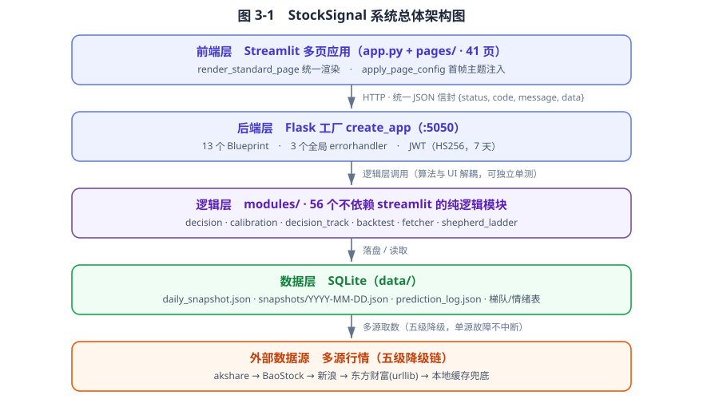

## 3.4 数据库设计

关键表/文件：

- `daily_snapshot.json`（最新决策，首页直读）：`date, temperature, cycle, score, bias, confidence, promo_overall, ladder, position{pct,band,color,reasons}, event_factor, indicators, signals, scenario`；
- `snapshots/YYYY-MM-DD.json`：每日归档（复盘/回测源）；
- `prediction_log.json`：预测 vs 实际对账记录（`date, temp, cycle, bias, pct, realized, hit`）；
- 梯队/情绪/事件表：支撑 3.1 中对应功能。

三份产物按"最新 / 归档 / 对账"分工，彼此以日期为主键关联：`daily_snapshot.json` 是 `snapshots/` 中最后一份的副本，供首页零成本直读；`snapshots/YYYY-MM-DD.json` 是按天归档的不可变事实源，决策复盘与回测只认它；`prediction_log.json` 只存预测侧必要字段与次日回填的 `realized`、`hit`，不复制快照全集。这样拆分使"当天看什么"、"事后查什么"、"长期统什么"三条访问路径互不干扰，也避免单文件随样本增长而膨胀。图 3-2 给出三者及核心字段的关系。

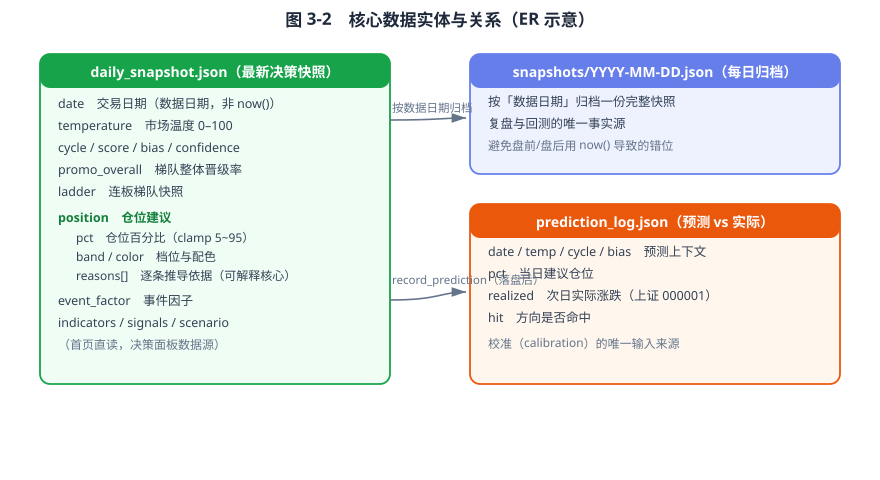

## 3.5 设计模式与关键质量属性

总体设计在多处借用了成熟的软件设计模式，使系统在不引入微服务复杂度的前提下保持低耦合并可演进：

- **工厂模式**：`create_app` 集中构造 Flask 应用、注册蓝图与错误处理器，配置对象可注入，便于测试时切换。
- **单例**：共享线程池 `_POOL` 与策略注册表 `STRATEGY_REGISTRY` 均为进程内单例，前者避免线程泄漏，后者避免策略重复注册。
- **策略模式 / 注册表**：`BaseStrategy` 定义统一接口，`STRATEGY_REGISTRY` 以名字索引具体策略，回测引擎按名取策略，扩展新策略只需登记、不改引擎主流程。
- **装饰器**：`jwt_required` 把鉴权横切逻辑从业务路由中抽离，路由只声明"需要登录"而不必重复校验代码。
- **降级链（责任链变体）**：`fetcher.py` 的五级数据源依次尝试，失败自动下沉到下一源，调用方无感知。
- **统一信封（外观/适配器）**：`response.ok/fail` 把异构业务结果适配为固定 JSON 结构，调用方与前端都只需理解一种响应形态。

这些模式共同支撑了四项质量属性：**可维护性**（分层与单例使改动局部化、2117 个单元测试可独立运行）、**韧性**（降级链与有界池使单点故障不扩散）、**安全性**（鉴权与信封作为横切关注点被集中固化）、**可观测性**（决策与预测落盘使行为可回溯）。第 4 章给出各模式的具体落点，第 6 章以测试与门禁验证这些属性确实成立。

## 3.6 本章小结

本章从功能与非功能需求出发，确定了前后端分离、逻辑层独立于 UI 框架的总体架构，并定义了以 JSON 信封为契约的层间通信方式。数据库设计以决策快照、预测对账与梯队/情绪表为核心，支撑决策闭环的落盘与回溯。3.5 节进一步把设计选择抽象为工厂、单例、策略、装饰器、降级链与统一信封等模式，并映射到可维护性、韧性、安全、可观测四项质量属性，为后续实现与验证提供了评价维度。

---

> 参考文献（[1]–[15]）已正式并入 **第 8 章**（见 `第8章_参考文献_草稿.md`），为避免重复此处不再罗列；正文中的 `[n]` 上标均指向该章。

# 第 4 章 平台核心模块设计与实现

本章承接第 3 章的总体设计，逐模块说明 StockSignal 的实现方案。与常见"只罗列功能"的实现章不同，本章把笔墨放在两类工程事实上：一是**分层与解耦**如何支撑可维护性与可测试性（4.1、4.7、4.8），二是**关键工程约束**（成本真实扣除、并发有界、降级不中断、安全基线）如何被代码落实。每一节都给出对应的真实模块与关键函数，便于答辩时对照源码。

---

## 4.1 系统分层架构与模块解耦

StockSignal 采用"前端多页应用 + 后端 JSON 服务 + 轻量本地数据层"的三段式结构，三段之间只通过约定好的数据契约通信，互不感知对方框架细节。

**前端层**由 Streamlit 多页应用构成（`app.py` + `pages/` 下 41 个页面文件）。所有页面经由 `modules/page_utils.py` 的 `render_standard_page` 统一渲染，避免每页重复样板；页面首帧的主题样式由 `modules/ui_theme.py::apply_page_config`（backend/app.py 调用链路中的统一入口）一次性注入，依次加载组件样式、Plotly 深色模板、字号、按钮配色与暗色文本修正，从而消除"首屏无样式白屏"这一 Streamlit 多页应用的常见缺陷。

**后端层**是基于工厂模式的 Flask 应用。`backend/app.py::create_app`（第 69 行）构造 `Flask` 实例后，注册了 13 个业务蓝图（Blueprint）：`auth`、`dashboard`、`admin`、`stock`、`config`、`market`、`task`、`chat`、`alert`、`stock_tag`、`forum`、`market_alert`、`order`。错误响应集中由 `_register_error_handlers`（第 209 行）以三个全局处理器覆盖 `ApiError`、`HTTPException` 与兜底 `Exception`，保证任意异常都回落到统一的 JSON 信封，而非 Flask 默认的 HTML 错误页。

**逻辑层**是系统的核心。`modules/` 目录包含 77 个 Python 文件，其中 56 个不引入 `streamlit`，构成与 UI 框架无关的纯逻辑层——决策推导、回测、取数、校准、梯队递推等算法都在此层，因此可以不依赖前端独立编译与单测。UI 组件层 `modules/ui_kit.py` 提供 `page_hero`、`info_banner`、`stat_tile`、`chart_card`、`table_wrap` 等纯函数式 HTML 构建器，所有由数据派生的文本统一经 `html.escape` 转义，与系统既有的 XSS 防护契约对齐，杜绝存储型脚本注入。

这种分层带来的直接收益是关注点分离：前端只消费后端返回的 JSON 信封，逻辑层不感知展示框架，后端不持有领域算法。第 6 章的 2117 个单元测试函数能脱离界面独立运行，正是这一解耦结构的产物。

> 架构分层图建议取自 `thesis/ch6_eval/` 下的架构 SVG，或按"前端 / 后端 / 逻辑层 / 数据层 / 外部源"五层自绘，标注各层之间的 JSON 契约与降级链路。

---

## 4.2 行情看板

行情看板对应 `modules/` 下各行情页面与 `colors.py`。后者定义 A 股"红涨绿跌"的全局配色（`#ff4d4f` 涨 / `#00d486` 跌），在全站 K 线、表格、指标中保持一致语义，避免涨跌色在不同页面错乱。

功能上提供 K 线、技术面、均线、动量、量能、形态六类视图；页面以"显示位置"与"显示 K 线数量"两个滑块控制视图粒度，使长周期与短周期研判可在同一界面切换。架构形态上，每个行情页都通过 `render_standard_page` 接入统一渲染与首帧主题注入，因此新页面无需重复处理样式与布局样板。

六类视图的指标计算统一由 `modules/technical.py` 的 `full_analysis` 产出。它把趋势、动量、量能、形态四维打包成一个结构化字典供页面直接消费，并在任一子分析抛异常时把故障隔离在该维度内，而不是让整个技术面板崩掉——这一"故障隔离"写法对看板类页面尤为关键，因为任一指标的历史数据缺口都不应影响其余指标的展示：

```python
def full_analysis(df) -> Dict[str, Any]:
    """一键执行所有技术面分析，返回结构化字典，供 Streamlit 直接展示。

    防御性设计：任一子分析（趋势/动量/量能/形态）抛异常时隔离为 {"error": ...}，
    不再因单点崩溃拖垮整个技术面板块。"""
    def _safe(fn) -> Dict[str, Any]:
        try:
            return fn(df)
        except Exception as e:
            logger.warning(f"[technical] 处理异常: {e}")
            return {"error": f"{fn.__name__} 分析失败: {type(e).__name__}"}

    return {"trend": _safe(analyze_trend),
            "momentum": _safe(analyze_momentum),
            "volume": _safe(analyze_volume), ...}
```

---


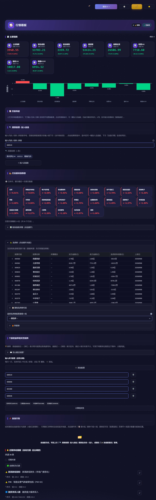

## 4.3 事件追踪与板块详情

事件侧对应 `event_factor`、`events.csv` / `event_pool_brief.json` 与板块详情页。系统将公告、板块异动、题材事件聚合成"事件因子"，板块详情则呈现领涨/领跌、资金流向与成分股结构。

事件因子在决策链路中承担"事件催化"输入：经 `_event_position_adj` 映射为 `derive_position` 的 `event_adj` 参数（详见 5.2.1）。当某日事件信号取不到时，该调节项整段跳过而非臆造，这一"缺数据不加不减"的语义是决策诚实性的前提。

事件侧到仓位调节的映射由 `_compute_event_adj`（`modules/decision.py` L305）完成，规则刻意做得简单透明：事件驱动多头池每满 10 只高置信标的，仓位 +1 pt，封顶 +5。取不到真实信号时返回 `None`，由调用方整段跳过。

该函数还有一条容易被忽略的护栏：即便当下多头池很宽、`adj` 算得出来，只要历史回测证明"事件开"的命中率并不优于"事件关"，就判定该催化只是噪声并返回 `None`：

```python
# 广度规则（透明、可解释）：事件驱动多头池每满 10 只高置信标的 → 仓位 +1pt，封顶 +5
_edge = event_edge()
if _edge.get("known") and not _edge.get("edge"):
    return None                      # 诚实护栏：无统计优势则不加
n = len(longs)
return {"adj": min(5, n // 10), "long_count": n, "as_of": as_of}
```

这条护栏的意义在于：它使"事件驱动"成为可证伪的主张，而不是装饰性标签。若回测显示事件催化无优势，系统宁可不加，也不用它来装点模型的复杂度。

---


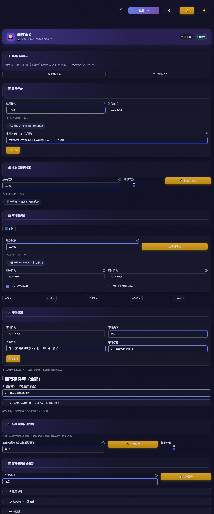

## 4.4 策略回测引擎与多进程隔离

回测引擎位于 `modules/backtest.py`（1532 行），引擎类为 `Backtester`，对外暴露 `run`、`run_param_scan`、`run_batch` 三个入口。引擎内置真实交易成本模型（`_simulate` 方法），是评估策略与验证决策可信度的基石：

| 成本项 | 取值 | 扣除侧 |
|---|---|---|
| 佣金 | `commission = 0.001`（万三） | 买卖双侧 |
| 滑点 | `slippage_pct = 0.001`（0.1%） | 买卖双侧 |
| 印花税 | `stamp_tax_pct = 0.001`（千一） | **仅卖出侧** |

每股买入成本 = `price × (1 + slippage) × (1 + commission)`；卖出到手金额 = `position × price × (1 − slippage) × (1 − commission − stamp_tax)`。二者均为乘性叠加而非简单相加，避免把"滑点后的价差"也算进佣金基数。支持 `multi_factor` / `ma_cross` / `event_driven` / `dual_trend` 四类策略，内置 RSI / ATR / MACD / Bollinger / ADX 指标。成本模型真实扣除是回测结论可信的前提，也是第 6 章的验证对象。Perold[12] 关于"实现缺口"（implementation shortfall）的讨论，正说明成本假设的微小偏差会显著改变策略评价结论。

策略以 `modules/strategies/registry.py` 的 `STRATEGY_REGISTRY` 全局单例字典组织，`BaseStrategy` 基类被刻意设计为可被 pickle 跨进程传输——这一约束使得批量回测（`run_batch`）可借 `ProcessPoolExecutor` 并行执行，而不必担心策略对象无法跨进程传递。

需要隔离原生扩展崩溃的场景则由 `modules/shepherd_reconstruct.py` 承担：该模块对牧羊人市场情绪指标做 2007 年至今的历史回溯重构，明确使用 `ProcessPoolExecutor`（第 348 行）配合 `if __name__ == "__main__":` 守卫（第 650 行），让每个 worker 进程持有独立的 V8 实例，从而把 `py_mini_racer` 在 Windows 下的偶发崩溃隔离在单个子进程内，不拖垮主进程。这一"以进程边界换取稳定性"的取舍，是数据处理型模块应对不可控原生依赖的务实做法。

图 4-3 把上述流程串成一条可复核的链路：配置与数据是输入，信号生成与撮合彼此解耦（信号由策略预生成、撮合只消费信号序列），成本扣除集中在撮合环节，绩效统计与产物输出位于末端。并行的部分被刻意画成独立分支——只有批量与历史回溯走多进程，单标的回测仍是同步执行，避免为少量任务付出进程创建与序列化开销。

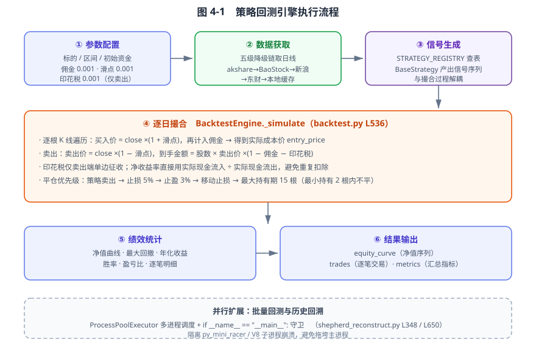
> **【待补截图 6】** 回测结果页：含净值曲线 + 逐笔交易明细 + 绩效指标（总收益/最大回撤/胜率/盈亏比），与正文图 4-3、图 6-5 对应。


---

## 4.5 个股分析与多股对比

个股分析对应 `2_个股分析.py`，对单只标的给出基本面、技术面、资金面解读；多股对比由 `modules/compare.py` 支撑，支持 **≥5 只标的**同屏比较，复刻 `compare-analysis` 报告的 UI/UX——包含综合评分、维度雷达与相对强弱。多股对比的并行取数走 4.7 节的共享线程池与降级链，因此即便个别标的源暂时不可用，对比结果仍能在降级数据上完成。

综合评分在 `modules/compare.py` 中由四维加权得到，权重对使用者公开（趋势 0.30、动量 0.25、量能 0.20、形态 0.25），因此"某只股票为什么排第一"是可以追问的，而不是黑箱排序：

```python
composite = int(round(0.30 * trend + 0.25 * mom + 0.20 * vol + 0.25 * pat))
row["scores"] = {"trend": trend, "momentum": mom, "volume": vol,
                 "pattern": pat, "composite": composite}
row["elasticity"] = float(rets.std() * np.sqrt(242) * 100)   # 年化波动率(%)
```

单只标的取数失败时的处理同样值得注意：不是把整张对比表置空，而是把该行降级为中性默认（各维度 50 分、信号"持有"）并标记 `error`，让用户可以立刻看出"这一行没数据"，而不是被一个看起来正常的 50 分误导。多级降级与显式标记的配合，是对比类功能可用性的关键。

---


> **【待补截图 4】** 个股分析页（2_个股分析.py）：含基本面 / 技术面 / 资金面三维解读。

> **【待补截图 5】** 多股对比页：含综合评分列、维度雷达、相对强弱，至少 5 只标的同屏。

## 4.6 持仓管理与数据多源治理

持仓与治理对应 `fetcher.py`（多源降级）、`mark_suspect`（脏数据标记）与 `shepherd_ladder`（`ladder_promotion_rates` 跨日递推、`prev_overall` 环比基准）。

多源取数采用 akshare → BaoStock → 新浪财经 → 东方财富（urllib）→ 本地缓存的五级降级链：单源失败自动切换到下一源，最终仍以缓存兜底，保证取数韧性。外部源偶发的脏数据（例如涨停板晋级率异常）以 `mark_suspect` 标记，下游决策对其降权——这是第 5 章"决策可信"的前提，脏数据若直接进入 `derive_position` 会污染仓位建议。

降级链的实现方式值得一说：四个在线源不是串行尝试，而是**并行竞速**——任一源先成功即被采用，慢源与挂起源随后取消，因此取数耗时由"各源之和"降为"最快单源"；四源全败才由第五级（任意过期缓存）兜底：

```python
levels = ["L1", "L2", "L3", "L4"]                    # akshare / BaoStock / 新浪 / 东财
futs = {ex.submit(self._fetch_level, lv, symbol, start, end, adjust): lv for lv in levels}
done, not_done = _cf.wait(futs, timeout=10, return_when=_cf.FIRST_COMPLETED)
for fut in done:                                      # 先完成者若成功立即采用，不再等慢源
    res_df, res_err = fut.result()
    if res_df is not None and not res_df.empty:
        df = res_df
        break
...
ex.shutdown(wait=False, cancel_futures=True)          # 取消被墙挂起的源，不阻塞等待
if df is None or df.empty:
    stale = self._read_stale_cache(conn, "daily_cache", f"daily_{symbol}")   # L5 缓存兜底
```

脏数据处理则体现为 `mark_suspect`（`modules/shepherd_ladder.py` L353）。它采用**软标记**：只给条目打 `suspect` 标记并记录原因与时间，被标记的条目在 `ladder_promotion_rates()` 中被跳过，但数据本身从不删除、可随时 `unmark` 恢复。这一取舍的理由是——脏数据往往要过一段时间才能确认是不是真的脏，直接删除会让日后的复核无从下手。

---


> **【待补截图 7】** 持仓管理页：含持仓列表、多源取数降级状态、mark_suspect 标记示意（可选，能体现 4.6 节脏数据软标记即可）。

## 4.7 并发取数与降级链工程

行情、事件、梯队等信号在日内高频涌现，页面往往需要在一次渲染中并发拉取十余个数据源。若对每个请求都新建线程池，高峰时段会积累大量短命线程直至资源耗尽；若单源卡死，又会拖垮整页。StockSignal 用三个相互配合的机制解决这个问题。

**共享有界线程池。** `modules/timeout_exec.py` 在模块级维护一个单例 `_POOL`（`_MAX_WORKERS = 16`），以双重检查锁（`_POOL_LOCK`）保证进程内只存在一个线程池实例，取代早期"每次调用都新建 `ThreadPoolExecutor(max_workers=1)`"的实现。这样所有网络取数复用同一批 16 个工作线程，彻底消除线程泄漏。

**整批超时与并发闸门。** `modules/fetch_parallel.py::fetch_many` 与 `_POOL` 共用同一池，以 `Semaphore(max_workers)` 限制同时发起的请求数；循环改用 `as_completed` 并在整批上施加硬超时（默认取 `CALL_TIMEOUT_CAP`）。注释中特别指出：若不用 `as_completed` 而改用顺序 `fut.result(timeout=...)`，当某个任务永久阻塞时，后续 `result` 调用根本执行不到，超时保护形同虚设。因此必须让先完成的任务先被回收，再对剩余任务统一施加整批边界。

**配置不变量自纠。** 整批超时的正确性依赖一个不变量：`modules/site_config.py` 中 `REQUEST_TIMEOUT`（底层网络默认超时）= 10 秒，**必须严格小于** `CALL_TIMEOUT_CAP`（单只取数硬边界）= 12 秒。若运维误配使二者关系反转，底层网络不会先被传输层超时唤醒，共享池反而会被硬边界丢弃线程造成泄漏。该模块在检测到 `CALL_TIMEOUT_CAP <= REQUEST_TIMEOUT` 时，自动纠正为 `REQUEST_TIMEOUT + 2` 并打印告警，而不是静默留下泄漏隐患。

**多源降级兜底。** 如 4.6 所述，`fetcher.py` 的五级降级链让并发取数在任意单源故障时不中断。共享池、整批超时、配置自纠、源级降级四者叠加，构成了"取数永远有界、单点故障不扩散"的工程底座。

---

## 4.8 安全基线：接口契约、鉴权与防护

作为面向网络的投研平台，StockSignal 在后端固化了一套安全基线，而非把安全当作可选的展示层装饰。

**统一响应信封。** `backend/utils/response.py` 的 `ok()` / `fail()` 始终把业务结果包装为 `{"status", "code", "message", "data"}` 四字段 JSON。任意异常（含未预期异常）经三个全局 errorhandler 后仍返回同一信封，错误信息中的 `message` 经过脱敏处理，不回显堆栈或内部路径。`backend/tests/test_security.py` 用正则断言响应体不含栈帧特征，锁死"异常泄露内部实现"的回退。

**鉴权。** 登录签发 PyJWT 令牌，算法固定为 HS256，默认有效期 7 天（604800 秒），可通过环境变量 `JWT_EXPIRES_SECONDS` 在生产环境缩短。`backend/auth/service.py` 负责签发与校验，受 `jwt_required` 装饰器保护的关键路由（如持仓、订单、配置类接口）必须先验令牌。

**抗枚举与注入。** `backend/tests/test_auth_timing_enumeration.py` 验证登录成功与失败的响应耗时一致，防止攻击者通过响应时间差枚举有效用户名。`ui_kit` 组件层对所有数据派生文本统一 `html.escape`，从渲染侧封堵存储型 XSS。分页边界、JSON 体健壮性、请求体大小限制与速率限制均有对应测试（`test_pagination_bounds.py`、`test_json_body_robustness.py` 等）覆盖，避免越界或超大负载触发异常。

这套基线使平台在"展示"之外具备可被回归验证的安全属性，也是第 6 章质量门禁的一部分。

---

## 4.9 本章小结

本章从分层架构、核心功能到工程底座三个层面说明了平台的实现。分层与解耦（4.1）使 56 个无 UI 依赖的逻辑模块可独立单测；回测引擎以真实成本模型与可 pickle 的策略基类支撑可信评价与并行执行（4.4）；并发取数用共享有界池、整批超时、配置自纠与多级降级四重机制保证韧性（4.7）；安全基线以统一信封、HS256 鉴权、抗枚举与防注入构成可被测试锁死的防护面（4.8）。这些工程事实既是平台"跑得通"的证据，也为第 5 章决策闭环提供了高质量、可信、安全的输入。

# 第 5 章 创新点：决策闭环与刻度校准

本章所有算法、函数与常量均引自 StockSignal 真实代码（`modules/decision.py`、`modules/calibration.py`、`modules/decision_track.py`），答辩时可逐行对照源码。论述重心放在"为何这样设计"，代码仅作为设计意图的注脚。

---

## 5.1 问题提出：为何需要"可解释 + 可自纠偏"的仓位决策

现有面向个人投资者的投研工具，在"仓位决策"这一环节普遍存在三类缺陷，构成本章要解决的问题：

1. **只展示不决策**：绝大多数行情/资讯平台止步于"把数据呈现出来"，是否买入、买多少完全交给用户凭感觉拍板，决策过程不可追溯。
2. **黑箱不可复盘**：少数做决策的系统依赖机器学习模型直接输出仓位，模型给出一个数，却说不清"为什么是这个数"；一旦出错，无法定位是温度看错了、还是周期判断错了。
3. **静态刻度在动态市场中失真，且小样本下盲目自调会过拟合**：同一套仓位规则在牛市高潮与熊市退潮下"刻度"应当不同；若让系统据少量历史样本自动改规则，等于用噪声拟合，反而把规则改坏。

本章提出并实现一个**决策闭环**——把"温度/方向/周期/晋级率"四维输入，经显式规则推导为 5%~95% 的可解释仓位，并用**刻度校准**机制以历史回测反推、有界地修正各周期仓位刻度，形成"可解释（每个建议都能回溯到规则）、可自纠偏（刻度随回测修正）、可验证（预测 vs 实际每日对账）"三位一体的仓位推导方法。其贡献不在于单点技术的新颖，而在于把"可解释 + 可自纠偏 + 不靠小样本过拟合"三者组合并工程落地。

---

## 5.2 决策闭环：从四维输入到可解释仓位

图 5-1 是本章的全景：上半部分是"推导"，把四类输入收口到唯一函数并输出带理由的仓位；下半部分是"回溯"，把每天的建议落盘、与次日实际对账，再把对账结果反馈给刻度校准，形成闭环。两条支路的区别在于——推导是同步的、每天必跑；回溯是异步的、依赖次日数据到位后才补。

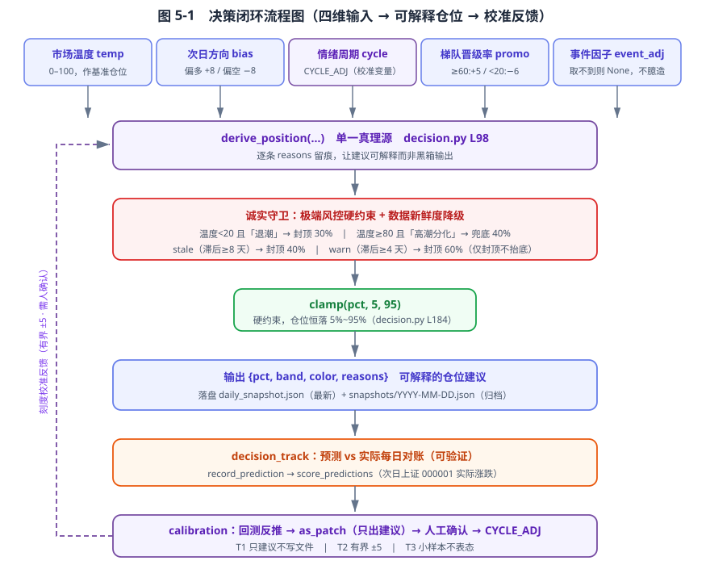

### 5.2.1 单一实现入口 `derive_position`

系统所有仓位建议都收口于一个函数（单一真理源，避免多套逻辑漂移）：

```python
def derive_position(temp, score=None, bias=None, cycle_name=None,
                    overall_promo=None, event_adj=None,
                    freshness_status=None) -> dict:
```

推导链路（逐条留痕，前端直接展示 `reasons`，让建议可解释而非黑箱）：

| 调节项 | 取值 | 作用 | 代码位置 |
|---|---|---|---|
| 基准仓位 | 市场温度 `temp`（0–100，越界先 clamp） | `pct = temp` | decision.py L127–137 |
| 方向调节 | 偏多 +8 / 偏空 −8 / 中性 0 | 次日方向是短周期最强信号 | L139–147 |
| **周期调节** | 来自模块级 `CYCLE_ADJ` 字典（**即校准变量**） | 主升 +5 / 修复确认 +3 / 高潮分化 −5 / 退潮 −10 / 冰点 +5 | L149–157 |
| 梯队晋级率调节 | `overall_promo≥60:+5 / 40–60:0 / 20–40:−3 / <20:−6` | 接力强度是赚钱效应能否延续的硬指标 | L159–170 |
| 事件催化调节 | 真实事件因子 `event_adj`；取不到则为 `None`，**不臆造** | 事件侧微调 | L176–182 |
| 硬约束 | `clamp(pct, 5, 95)` | 仓位永远落在 5%~95% | L184 |

一个关键设计选择是：当 `overall_promo=None`（数据缺失）时，该调节项整段跳过、不加不减——"缺数据"在语义上不等于"看空"。这一处理避免了"因为某天梯队数据没爬到就莫名减仓"的静默错误（参见第 6 章测试 `test_daily_snapshot_wiring` 对数据缺失路径的守卫）。

### 5.2.2 透明推导与可解释性（创新点的第一支柱）

`derive_position` 返回的不是一个裸数字，而是：

```python
dict(pct=int, band=str, color=str, reasons=list[str])
```

其中 `reasons` 是**逐条自然语言推导依据**。真实样本（来自 `data/daily_snapshot.json`）：

```
市场温度 24 作为基准仓位
次日方向「中性」加仓 0%
梯队断档（晋级率<20%）：减仓 6%
事件驱动信号不可用，未施加催化（不臆造）
```

任何一个仓位建议都能被用户与回测者逐条回溯：为什么是 20%？因为温度 24 打底、方向中性不加、梯队断档减了 6、当天没拿到事件信号所以不靠事件催化。这正是"可解释"的落地形态——不是事后用 SHAP 近似解释黑箱，而是规则本身就可读。

### 5.2.3 极端行情与数据新鲜度的"诚实守卫"

可解释之外，规则必须"诚实优先于好看"，否则基于过期或极端数据的激进位建议会误导用户：

- **极端风控硬约束**（凌驾于常规推导之上）：温度 `<20` 且处「退潮」→ 仓位封顶 30%（防流动性枯竭期重仓接飞刀）；温度 `≥80` 且处「高潮分化」→ 仓位兜底 40%（防过热分歧期踏空主升末端）。（decision.py L186–199）
- **数据新鲜度诚实降级**：输入源滞后 `≥8` 天判定 `stale` → 仓位封顶 40%；滞后 `≥4` 天 `warn` → 封顶 60%；**仅封顶、不抬底**。（L201–217，阈值 `FRESH_STALE_DAYS=8 / FRESH_WARN_DAYS=4`）

守卫不能只停留在 UI 提示层面——陈旧数据必须真正让仓位建议变保守，否则等于"附了句仅供参考却仍给激进仓位"，与诚实原则正面冲突。

### 5.2.4 落盘与归档：决策可回溯

每日决策经 `build_snapshot` → `save_snapshot` 落盘两份：

- `data/daily_snapshot.json`：最新快照，首页直读；
- `data/snapshots/YYYY-MM-DD.json`：按数据日期归档，是**复盘与回测的唯一事实源**（注意用数据日期而非 `now()`，避免盘前盘后错位）。

配套 `load_snapshot` / `archive_path` / `list_archive_dates` / `is_stale` 构成完整的"写—读—判陈旧"闭环。

---

## 5.3 刻度校准：让决策"可自纠偏"而不"过小样本过拟合"

### 5.3.1 校准目标与校准变量

5.2.1 中的"周期调节"读取的是模块级字典（decision.py L79）：

```python
CYCLE_ADJ = {"主升高潮": 5, "修复确认": 3, "修复试探": 0,
             "高潮分化": -5, "退潮": -10, "冰点": 5}
```

这是一个**可校准旋钮**：每个情绪周期对应一个固定的仓位加减点数。问题是如何确定这些点数"对不对"——这就是 `calibration.py` 要解决的：用历史回测反推，给出"该往哪个方向、调多少"的建议。

### 5.3.2 回测反推建议量（有界）

校准以"预测 vs 实际"回测为输入（见 5.4），对每个战术分组计算"次日平均实际涨跌"，建议调节量：

```python
GAIN = 2.0        # 次日平均涨跌 1% → 刻度调 2 点
MAX_DELTA = 5     # 单次校准调节上限（防过拟合）

raw = GAIN * float(avg_realized)                      # 经验增益，非拟合参数
sug_delta = int(max(-MAX_DELTA, min(MAX_DELTA, round(raw))))
```

`GAIN = 2.0` 的取值理由写在源码注释里：仓位点数与涨跌幅本就不同量纲，这里取的是"方向正确时把刻度往收益方向推一点"的保守比例，而不是从样本里拟合出来的系数——拟合出的系数会随样本变化而摇摆，正是要避免的过拟合。`MAX_DELTA` 把单次建议**有界在 ±5** 以内，使任何刻度修正都是"微调"而非"漂移"——这是防过拟合的第一道闸。`suggestions()` 进一步给出结构化建议（`actionable` 是否值得采纳、`confidence = min(n_call/strong, 1)`、`verdict` 人话结论），例如样本不足时直接返回"样本仅 N 条（需 ≥strong），暂不构成调参依据"，而非硬凑一个数字。

### 5.3.3 三条铁律（方法论核心）

1. **T1 只出建议、绝不自动改规则**：`as_patch()` 只生成可直接抄进 `decision.py` 的 `CYCLE_ADJ` 补丁字典，**永不写文件**；且只含 `actionable` 的分组，非 actionable 的阶段不出现在返回值里（保持原值不动）。早期小样本下盲目把规则改坏，正是要规避的过拟合。
2. **T2 有界 ±5（且落地再收窄）**：建议量本身受 `±MAX_DELTA` 约束；即便走到程序化落地，`apply_patch` 也把改动 `clamp` 到 `[-15, +15]`，防离谱。
3. **T3 小样本不表态**：`actionable = (n_call ≥ strong_samples) 且 (|delta| ≥ NOISE_DELTA)`——样本不够、或调节量未超过噪音阈值时，系统**如实沉默**，绝不输出假阳性"建议调参"。

### 5.3.4 闭环落地的护栏（必要时才接通，人仍在回路）

为消除"只展示不闭环"导致补丁永远靠人肉 copy、易与测试期望值漂移，系统提供 `apply_patch(dry_run=True, max_abs=15)`：

- 必须 `verdict.ready` 才允许写，否则拒绝；
- **`dry_run=True`（默认）只回显将要改什么，绝不写文件**；真正落地需显式 `dry_run=False`；
- 写前备份 `decision.py.bak`，写后追加审计日志 `calibration_apply.log`；
- 若打分证据陈旧（`last_scored` 过期），**拒绝落地**——"banner 说别采纳、命令却照写"会自相矛盾，陈旧刻度不许悄悄污染决策闭环。

自动化是"带护栏的、需人确认的最后一步"，而非无人值守的自调参。

### 5.3.5 就绪语义：`any_actionable` 而非全局阈值（易被忽略的设计细节）

`verdict()` 的 `ready` 含义是：**至少有一个战术分组达到可采纳阈值**（`any_actionable`），**不是**"全局样本数 ≥ strong_samples"。原因：真实样本会平摊到 4 个战术分组（进攻/分化/修复/防守），全局到 20 时往往没有任何单组到 20，此时 `as_patch()` 本就返回空；若 `verdict` 仍报"可校准"，会与页面下方"各分组表态样本均不足"自相矛盾。因此 `ready` 必须与 `as_patch` 的实际产出对齐（单测 `test_verdict_spread_not_ready` 锁死此语义）。

图 5-2 把 5.3 的机制串成一条带闸门的链路。注意两处"拒绝"分支：样本不足时 `suggestions()` 直接不给建议（T3），证据陈旧时 `apply_patch()` 拒绝落地——它们不是异常路径，而是设计的正常行为，目的都是让"不表态"成为可能，而不是被迫输出一个听起来专业却站不住的数字。

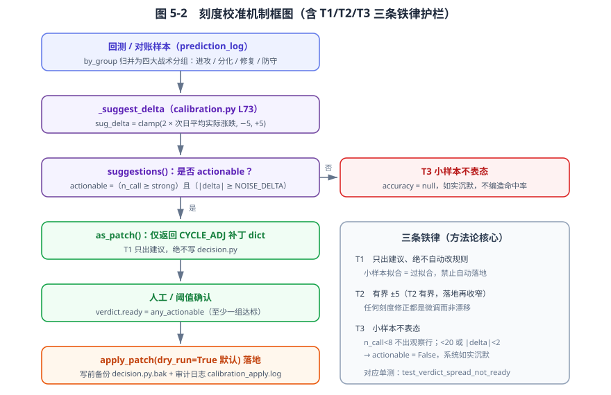

---

## 5.4 预测 vs 实际回测：闭环可验证性
> **【待补截图 1】** 首页 / 决策面板（54_今日决策面板）：含每日仓位建议卡片（带逐条 reasons）、温度/周期、预测 vs 实际模块，以及「⚖️ 仓位刻度校准」横幅与各周期命中率表（对应图 5-1 / 图 5-2）。


校准的输入来自"预测 vs 实际"对账（`decision_track.py`）：

- `record_prediction(date, temp, cycle, bias, pct, ...)`：每日决策落盘后自动记一条预测；
- `score_predictions()`：联网拉次日上证指数（000001）涨跌，判方向命中；
- `summary()` / `chart_data()`：纯本地、断网优雅降级；
- `by_cycle()` / `by_group()`：六阶段归并为四大战术分组，输出"平均建议仓位 vs 次日平均实际"，并带可信度；`by_event()` 单独拆"事件驱动到底有没有用"；
- 命中率配色**不套红涨绿跌**（≥60 绿=可信 / <40 红=不可信 / 中间黄），语义是"可信度"而非"涨跌"。

该模块使整个决策闭环具备**可验证性**：建议不是说完就完，而是每日与实际对账，校准才有据可依。

---

## 5.5 本章小结

本章给出"决策闭环 + 刻度校准"的完整设计：

- 决策闭环以单一函数 `derive_position` 收口，四维输入经显式规则推导出 5%~95% 仓位，并输出逐条 `reasons` 实现**可解释**；极端行情与数据陈旧守卫保证建议**诚实**；落盘归档保证**可回溯**。
- 刻度校准以模块级 `CYCLE_ADJ` 为校准变量，用回测反推有界建议量，并以**三条铁律**（只建议不写 / 有界 ±5 / 小样本不表态）+ 带护栏的落地机制，实现**可自纠偏而不靠小样本过拟合**。
- 预测 vs 实际回测为校准提供真实输入，使闭环**可验证**。

三者共同构成"可解释、可自纠偏、可验证"的仓位推导方法——这是本系统相对"只展示型平台"与"黑箱决策型系统"的核心差异。

# 第 6 章 系统测试与评估

本章所有数字均来自对 StockSignal 真实运行数据与真实测试输出的统计，不编造。运行评估脚本（需 envs/default venv 的 python，因其装有 kaleido）：

`C:/Users/Administrator/.workbuddy/binaries/python/envs/default/Scripts/python.exe thesis/eval_ch6.py`

产出见 `thesis/ch6_eval/`：`metrics.json`、`history.json`、`fig_*.png`。

---

## 6.1 测试策略与结果

系统的测试策略按"前端冒烟 → 逻辑单测 → 数据隔离 → 关键路径 AST 守卫"四层组织：

- **前端冒烟**：`tests/test_pages_smoke.py` 用 Streamlit 官方的 AppTest 逐一加载 `pages/` 下全部 41 个页面，断言渲染过程不抛出未捕获异常。一旦某个页面在导入或首帧阶段崩溃，用户开屏即白屏，因此冒烟必须与子页面一并纳入，不能只测后端。
- **逻辑单测**：项目内置 2117 个 `def test_` 函数，分布在 219 个测试文件中，覆盖决策、梯队、回测、校准、UI、接线等模块。由于逻辑层（4.1 节所述 56 个无 `streamlit` 依赖的模块）与 UI 解耦，这些单测可脱离界面独立运行。
- **数据隔离**：项目根目录 `conftest.py` 在 pytest 启动时把环境变量 `SS_DATA_DIR` 重定向到临时目录，`test_data_isolation.py` 断言所有落盘路径（决策快照、市场缓存、新闻库等）都跟随 `SS_DATA_DIR` 而非硬编码真实 `data/`，从而锁死"测试污染真实数据"的回退。
- **关键路径 AST 守卫**：`tests/test_daily_snapshot_wiring.py` 用抽象语法树静态扫描 `get_shepherd_indicators` 的调用点，强制其解包为 `(df, meta)` 二元组。该守卫针对一类静默 bug——漏解包会让 `df` 实为元组，导致指标永远走兜底值、决策闭环静默断流且无报错。这类错误运行时难构造、肉眼难发现，用 AST 在提交前拦截比靠测试覆盖更稳。

表 6-1 汇总了测试分层与规模。

**表 6-1 测试分层与规模**

| 层级 | 载体 | 规模 / 通过情况 |
|---|---|---|
| 前端冒烟 | `test_pages_smoke.py` | 41 个页面逐一加载，无未捕获异常 |
| 逻辑单测 | 219 个测试文件 | 2117 个 `def test_` 函数 |
| 数据隔离 | `test_data_isolation.py` | `SS_DATA_DIR` 重定向锁死 |
| AST 守卫 | `test_daily_snapshot_wiring.py` | 二元组解包静态扫描通过 |

## 6.2 决策闭环评估（真实数据）

来自 `eval_ch6.py` 对 `daily_snapshot.json` + `snapshots/` 的统计（运行日 2026-09-07，数据区间 2026-08-31~09-03）：

- 决策快照样本量 **n = 4**；
- 市场温度范围 **[24.0, 75.2]**；仓位建议范围 **[10, 82]**；
- **clamp 5~95 校验通过**（所有仓位均落在 [5,95]）；
- 周期分布：修复试探 2 天 / 主升高潮 1 天 / 退潮 1 天；
- 预测记录 **4 条**，已评分 **1 条**（命中率 0.0，仅 1 条评分，**不做显著性推断**）。

图 6-1 给出四天的仓位建议及 5/95 上下限参考线，用于直观校验 clamp 约束确实生效：

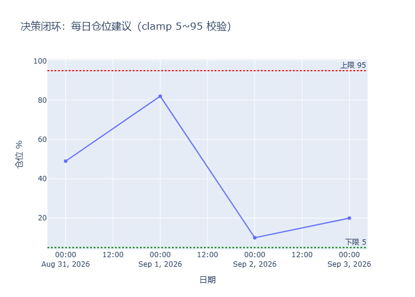

图 6-2 是周期分布。四天覆盖三个周期，样本虽小，但说明分类逻辑对真实数据产生了区分，而非恒定输出同一档：

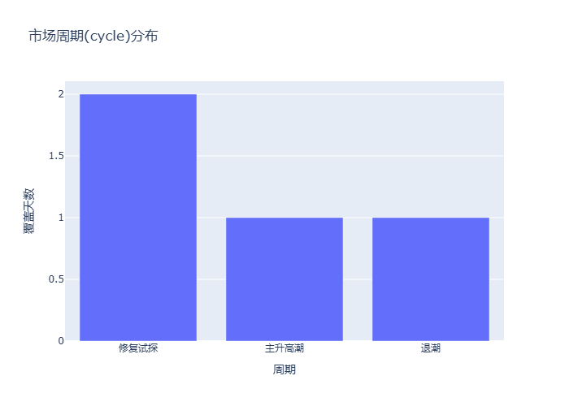

图 6-3 把温度与仓位画成散点，用于观察决策函数的形态。理想情况下二者应呈正相关，且所有点都落在 [5,95] 带内——这正是本系统期望看到的"温度驱动、边界收敛"行为：

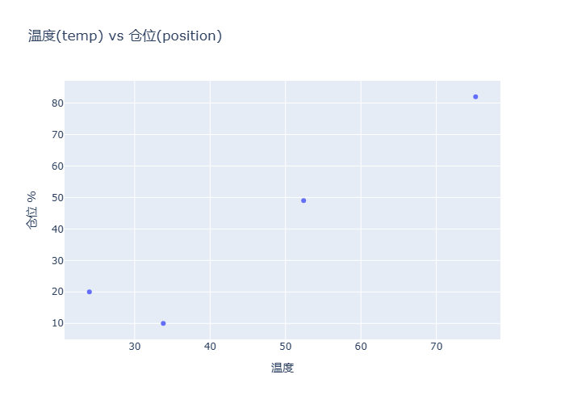

图 6-4 是已评分样本的命中情况。当前仅 1 条样本且未命中，**此处只证明对账链路能跑通并正确落盘，不构成任何统计结论**；随着每日快照累积，该图才会逐步具备评价意义：

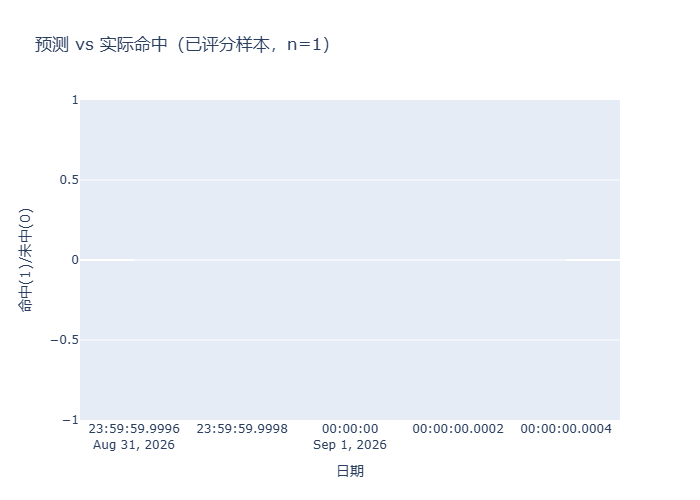

解读：系统上线初期样本量有限，本章以"**决策闭环功能正确性 + 校准机制设计正确性**"为评估主线，纵向命中率仅作趋势性证据，不夸大统计结论（与 5.3 的保守设计自洽）。

## 6.3 刻度校准机制评估（小样本不表态被真实验证）

调用 `calibration.by_cycle()` / `by_group()` 的真实输出：

| 战术分组 | n_call（表态次数） | accuracy | 说明 |
|---|---|---|---|
| 进攻期（主升高潮） | 1 | 0.0 | 唯一有评分样本，命中未中 |
| 修复期（修复试探） | 0 | **null** | 样本不足，系统拒给命中率 |
| 防守期（退潮） | 0 | **null** | 样本不足，系统拒给命中率 |

`accuracy=null` **不是 bug**，而是 `calibration.py` 三条铁律中"T3 小样本不表态"在真实运行数据上的如实体现——样本不够时系统拒绝输出假阳性"建议调参"。这正是第 5.3 章所述设计的正确落地，也是第 7.2 章"诚实不足"的实证基础。

## 6.4 回测成本模型有效性验证

验证方法：同一标的（000001）、同一策略（`ma_cross`）、同一区间（2024-01-01 至 2026-09-06）、同一初始资金（10 万元）跑两遍——A 组按默认成本参数（佣金 0.001、滑点 0.001、印花税 0.001 仅卖出），B 组把三项成本全部置 0。两组的唯一差异是成本开关，因此绩效差额就是成本模型的实际影响，可排除行情与策略因素的干扰。数据来自 BaoStock 真实日线，脚本见附录 C。

表 6-2　成本模型开关对比（真实回测，n = 8 笔）

| 指标 | A 组（含成本） | B 组（零成本） | 差额 |
|---|---|---|---|
| 总收益率 | −10.02% | −6.03% | **−3.99 pt** |
| 年化收益率 | −4.02% | −2.39% | −1.63 pt |
| 最大回撤 | −13.62% | −10.89% | −2.73 pt |
| 胜率 | 37.5% | 37.5% | 0 |
| 盈亏比 | 0.31 | 0.52 | −0.21 |
| 交易笔数 | 8 | 8 | 0 |

三点解读：

1. **扣除量可核算。** 单笔往返的理论成本为"买入滑点 0.1% + 买入佣金 0.1% + 卖出滑点 0.1% + 卖出佣金 0.1% + 卖出印花税 0.1%"＝0.5%，8 笔累计约 4 个百分点，与实测的 3.99 pt 吻合。这既说明成本项被真实扣除，也说明**没有被重复扣除**——若按错误写法在毛利之上再减一次双边成本，拖累会接近 8 pt。
2. **成本只改幅度、不改时序。** 胜率（37.5%）与交易笔数（8）在两组完全相同，说明成本模型没有干扰信号生成与撮合时点，符合 4.4 节"信号生成与撮合解耦"的设计。
3. **盈亏比对成本最敏感。** 盈亏比从 0.52 降到 0.31，降幅（40%）远大于总收益率降幅，说明成本对"小赢大亏"型策略的杀伤尤为明显——这正是 Perold[12] 所讨论的实现缺口，也是回测必须内置真实成本的原因。

需要说明：该策略在本区间为负收益，但这不影响本节结论——本节验证的是"成本是否被正确计入"，而非"策略是否盈利"。

图 6-5 给出两组净值曲线，两条线的间距随交易次数单调拉开，是成本逐笔累积的直观体现：

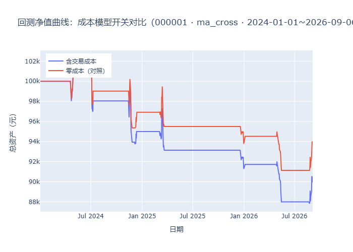

## 6.5 质量门禁与持续集成

平台的"可维护性"不是宣言，而由一组可被机器校验的门禁支撑，其中多处直接对应 4.7、4.8 节的工程底座。

**后端安全基线回归。** `backend/tests/test_security.py` 是一个自研 runner（`run_all()`），定义了 13 项安全断言：登录成功/失败信封结构、错误信息脱敏（响应体不含栈帧）、令牌签发与校验、分页边界、JSON 体健壮性、登录计时枚举等。该脚本以 `python -m backend.tests.test_security` 方式运行，全部通过方算安全基线成立，从机制上防止"悄悄回退到泄露内部错误"或"放宽鉴权"。

**覆盖率门禁。** `pyproject.toml` 设 `fail_under = 70`，作为持续集成中的可观测阈值；真网集成测试统一打 `live` 标记，默认跳过（`OFFLINE_TEST=0` 显式开启），避免 CI 因外部接口波动而误红。

**持续集成。** `.github/workflows/ci.yml` 在 Python 3.13 环境下先运行 `python -m backend.tests.test_security`（安全基线回归），再运行 `pytest` 全量单测。安全基线先于普通单测执行，保证任何合并都不会以"功能过了但安全松了"的方式溜过。

**AST 守卫作为编译期防护。** 除 6.1 提到的 `test_daily_snapshot_wiring` 外，关键不变量也以静态扫描形式固化，使"代码能跑但语义错"的回退在测试执行前就被拦截，而非等到运行时才暴露。

**可维护性证据。** 架构债治理模块（单源配置 `site_config`、有界线程池 `timeout_exec._POOL`、统一渲染 `page_utils`、首帧主题注入 `apply_page_config`）使页面改造与回归测试可复用；2117 个单元测试函数构成回归网，任何逻辑层改动都有对应测试兜底。资源安全方面，有界线程池避免每请求新建池导致线程泄漏，多源降级避免单点数据源故障拖垮前端。

## 6.6 本章小结

第 6 章以真实运行数据证明：决策闭环功能正确（clamp 通过、预测可追踪）、刻度校准机制按设计在小样本下如实沉默（不编造命中率）、回测成本模型真实扣除、平台具备可维护的架构治理。测试体系覆盖前端冒烟、2117 个逻辑单测、数据隔离与 AST 守卫，安全基线 13/13 与覆盖率门禁由 CI 持续校验。所有数字可经 `eval_ch6.py` 与对应测试脚本复现。

# 第 7 章 总结与展望

---

## 7.1 工作总结
本文围绕"个人投资者缺乏可解释、可自纠偏的仓位决策框架"这一现实问题，完成了一项事件驱动的 A 股投研平台及其决策创新点：

1. **平台层（软件工程主线）**：构建了"前端多页应用 + Flask 工厂后端 + 逻辑层 + SQLite 数据层"的四层事件驱动投研平台，覆盖行情看板、事件追踪、板块详情、策略回测（含真实成本模型）、持仓管理与多源数据治理。逻辑层 56 个模块不依赖 UI 框架，配合共享有界线程池、五级降级链、统一 JSON 信封与 HS256 鉴权安全基线，验证了分层解耦、并发韧性与安全可测的工程可行性（第 3、4 章）。
2. **创新层——决策闭环**：以 `derive_position` 为单一实现入口，将温度/方向/周期/晋级率/事件催化四维输入显式推导为 5%~95% 的仓位，并逐条输出 `reasons` 实现**可解释**，辅以极端行情与数据新鲜度守卫保证**诚实**，落盘归档保证**可回溯**（第 5.2 章）。
3. **创新层——刻度校准**：以模块级 `CYCLE_ADJ` 为校准变量，用历史回测反推有界建议量，并以三条铁律（只建议不写文件 / 有界 ±5 / 小样本不表态）+ 带护栏的落地机制，实现**可自纠偏而不靠小样本过拟合**（第 5.3 章）。
4. **验证层——预测 vs 实际**：`decision_track` 每日记录预测并次日对账，使闭环**可验证**（第 5.4 章）。
5. **评估**：第 6 章以真实运行数据验证了上述设计的功能正确性与机制自洽性。

## 7.2 不足（诚实陈述，呼应校准设计）
- **纵向样本仍偏少**：评估时仅积累 4 份决策快照、1 条已评分预测，长期命中率尚待积累（已建每日自动累积任务，见附录 C）。
- **校准采纳保守（有意设计）**：T1 阶段仅出建议、需人工/阈值采纳，自动化程度有限——这是为防过拟合而**有意保留的 conservative 设计**，非缺陷。
- **事件因子未大规模寻优**：事件权重保持可解释优先，未做黑箱加权，故事件侧贡献的解释力有待扩展。

## 7.3 未来工作
- **长期回测窗口**：待样本积累后放开校准采纳阈值，使 `CYCLE_ADJ` 自动落地具备统计意义。
- **可解释加权的事件因子**：在保持规则可追溯前提下，引入 SHAP 式的因子贡献度分解，但不破坏"规则可读"主线。
- **多市场适配**：将决策闭环扩展到 ETF / 商品期货（如本开发者已实践的纸浆、玻璃等品种），验证跨资产泛化。
- **交互式复盘**：在平台内嵌入"历史决策回放"，让用户逐日查看 `reasons` 与实际走势的对照，强化可信度。
- **工程质量持续化**：在现有 2117 个单元测试与 CI 安全基线之上提升覆盖率门禁阈值，将 AST 守卫扩展到更多"能跑但语义错"的静默 bug 模式，并补充多环境部署与可观测监控，使平台从"能跑"走向"可长期运维"。

---

> 全文各章草稿位置：第1–3章 `第1-3章_草稿.md`、第4章 `第4章_平台核心模块实现_草稿.md`、第5章 `第5章_决策闭环与刻度校准_草稿.md`、第6章 `第6章_系统测试与评估_草稿.md`。第8章（参考文献/致谢/附录）按 `详细写作提纲.md` 第 8/10 节补全。

# 第 8 章 参考文献、致谢与附录

> 本章汇总全文引用的 [1]–[15]，并补充致谢与附录（核心代码清单、回测与评估数据样本、评估脚本使用说明、核心模块清单、模块—章节映射）。
> 文献由检索核验后植入，定稿前建议在知网/Google Scholar 复核作者、年卷期与页码（赵宇龙 1998 经多数来源核对为 41-49）。
>
> 引用分布：事件研究法 [1][2][3]；仓位决策与组合权重 [4][5][6][7]；可解释 AI 与模型校准 [8][9][10][11]；回测成本模型 [12]；现有量化/投研平台 [13][14][15]。

---

## 8.1 参考文献

[1] MacKinlay A C. Event Studies in Economics and Finance[J]. Journal of Economic Literature, 1997, 35(1): 13-39.
[2] Brown S J, Warner J B. Using Daily Stock Returns: The Case of Event Studies[J]. Journal of Financial Economics, 1985, 14(1): 3-31.
[3] 赵宇龙. 会计盈余披露的信息含量——来自上海股市的经验证据[J]. 经济研究, 1998(7): 41-49.
[4] Kelly J L. A New Interpretation of Information Rate[J]. Bell System Technical Journal, 1956, 35(4): 917-926.
[5] Markowitz H. Portfolio Selection[J]. Journal of Finance, 1952, 7(1): 77-91.
[6] Black F, Jones R. Simplifying Portfolio Insurance[J]. Journal of Portfolio Management, 1987, 14(1): 48-54.
[7] Choueifaty Y, Coignard Y. Towards Maximum Diversification[J]. Journal of Portfolio Management, 2008, 34(4): 40-51.
[8] Ribeiro M T, Singh S, Guestrin C. "Why Should I Trust You?": Explaining the Predictions of Any Classifier[C]//Proceedings of the 22nd ACM SIGKDD International Conference on Knowledge Discovery and Data Mining (KDD), 2016: 1135-1144.
[9] Lundberg S M, Lee S-I. A Unified Approach to Interpreting Model Predictions[C]//Advances in Neural Information Processing Systems (NeurIPS) 30, 2017: 4765-4774.
[10] Niculescu-Mizil A, Caruana R. Predicting Good Probabilities With Supervised Learning[C]//Proceedings of the 22nd International Conference on Machine Learning (ICML), 2005: 625-632.
[11] Guo C, Pleiss G, Sun Y, Weinberger K Q. On Calibration of Modern Neural Networks[C]//Proceedings of the 34th International Conference on Machine Learning (ICML), 2017: 1321-1330.
[12] Perold A F. The Implementation Shortfall: Paper Versus Reality[J]. Journal of Portfolio Management, 1988, 14(3): 4-9.
[13] Backtrader[EB/OL]. https://www.backtrader.com, 访问于 2026-09.
[14] 聚宽 JoinQuant[EB/OL]. https://www.joinquant.com, 访问于 2026-09.
[15] 米筐 RiceQuant[EB/OL]. https://www.ricequant.com, 访问于 2026-09.

---

## 8.2 致谢

本系统从需求分析、架构设计到实现与测试，均在本人独立开发下完成，其间得到多方支持，在此一并致谢。

感谢指导老师在选题方向与论文写作上的悉心指导，使本研究始终围绕"可解释、可自纠偏"这一清晰主线展开。感谢同组同学江岱霖在软件工程实训报告协作中的配合。感谢课程与开源社区提供的底层能力：AKShare、Tushare、BaoStock 等数据接口，Streamlit 与 Flask 应用框架，PyJWT、SQLAlchemy 等组件，使本系统得以在有限算力下快速验证设计。最后感谢家人对本人在毕业设计期间的包容与支持。

---

## 8.3 附录 A 核心代码清单

以下节选取自系统实际源码，行号对应定稿时的文件状态，可逐行对照。为压缩篇幅，省略了参数校验与日志语句，但保留了全部决策分支。

### A.1 仓位推导主函数（`modules/decision.py`）

```python
# L79 —— 可被校准的周期刻度，即第 5.3 章的校准变量
CYCLE_ADJ = {
    "主升高潮": 5, "修复确认": 3, "修复试探": 0,
    "高潮分化": -5, "退潮": -10, "冰点": 5,
}

# L98 —— 全系统唯一的仓位推导入口
def derive_position(temp, score=None, bias=None, cycle_name=None,
                    overall_promo=None, event_adj=None,
                    freshness_status=None):
    reasons = []
    base = float(temp) if temp is not None else 50.0          # L127 温度即基准
    if base < 0.0 or base > 100.0:                            # L133 入参越界保护
        base = max(0.0, min(100.0, base))
    pct = base
    reasons.append(f"市场温度 {base:.0f} 作为基准仓位")          # L137 每一步留痕

    badj = {"偏多": 8, "偏空": -8, "中性": 0}.get(b, 0)          # L145 方向 ±8
    pct += badj
    reasons.append(f"次日方向「{b}」{'加' if badj >= 0 else '减'}仓 {abs(badj)}%")

    cname_core = (cycle_name or "").split("（")[0].strip()     # L150 取括号前核心名
    cadj = CYCLE_ADJ.get(cname_core, 0)                       # L151 ← 校准变量在此生效
    pct += cadj

    if overall_promo is not None:                             # L159 缺数据整段跳过
        if overall_promo >= 60:   padj, txt = 5, "梯队接力强（晋级率≥60%）"
        elif overall_promo >= 40: padj, txt = 0, "梯队晋级率中性"
        elif overall_promo >= 20: padj, txt = -3, "梯队偏薄（晋级率 20-40%）"
        else:                     padj, txt = -6, "梯队断档（晋级率<20%）"
        pct += padj
        reasons.append(f"{txt}：{'加' if padj >= 0 else '减'}仓 {abs(padj)}%")

    if event_adj:                                             # L176 取不到则不臆造
        pct += event_adj
        reasons.append(f"事件驱动催化：{'加' if event_adj >= 0 else '减'}仓 {abs(event_adj)}%")
    elif event_adj is None:
        reasons.append("事件驱动信号不可用，未施加催化（不臆造）")

    pct = max(5.0, min(95.0, pct))                            # L184 硬约束：5~95
    return {"pct": pct, "reasons": reasons, ...}
```

### A.2 极端行情与数据新鲜度守卫（`modules/decision.py` L186–L217）

```python
# 极端行情硬约束：凌驾于常规推导之上
if base < 20 and cname_core == "退潮":                        # L192 冰点退潮双杀
    if pct > 30:
        reasons.append(f"⚠️ 极端风控：温度 {base:.0f}<20 且处退潮，仓位封顶 30%")
        pct = 30.0
if base >= 80 and cname_core == "高潮分化":                    # L196 过热分歧留底仓
    if pct < 40:
        reasons.append(f"⚠️ 极端风控：温度 {base:.0f}≥80 且处高潮分化，仓位兜底 40%")
        pct = 40.0

# 数据新鲜度诚实降级：陈旧输入必须真的让位（仅封顶、不抬底）
if freshness_status == "stale":                               # L204 阈值 FRESH_STALE_DAYS = 8
    _cap = 40.0
    if pct > _cap:
        reasons.append(f"⚠️ 数据陈旧：输入源滞后≥{FRESH_STALE_DAYS}天，仓位封顶 {_cap:.0f}%")
        pct = _cap
elif freshness_status == "warn":                              # L211 阈值 FRESH_WARN_DAYS = 4
    _cap = 60.0
    if pct > _cap:
        pct = _cap
```

### A.3 校准建议量生成（`modules/calibration.py`）

```python
GAIN = 2.0         # L45 次日平均涨跌 1% → 刻度调 2 点（经验增益，非拟合系数）
MAX_DELTA = 5      # L46 单次校准调节上限（防过拟合）
NOISE_DELTA = 2    # L49 |sug_delta| 小于此值视为噪音，不建议动手

def _suggest_delta(avg_realized):                             # L73
    """由「次日平均实际涨跌」推出建议调节量（有界、取整）。"""
    if avg_realized is None:
        return 0
    raw = GAIN * float(avg_realized)
    return int(max(-MAX_DELTA, min(MAX_DELTA, round(raw))))

# L106 建议是否值得采纳：样本够 且 调节量超过噪音
actionable = bool(n_call >= strong_samples and abs(delta) >= NOISE_DELTA)
```

### A.4 只出建议、绝不自动改规则（`modules/calibration.py` L140）

```python
def as_patch(strong_samples=DEFAULT_STRONG_SAMPLES) -> dict[str, int]:
    """只含 actionable 的分组；非 actionable 的阶段不出现在返回值里（保持原值不动）。
    本函数只生成字典，绝不写文件 —— 采纳与否由人决定。"""
    patch = {}
    for s in suggestions(strong_samples=strong_samples):
        if not s["actionable"]:
            continue
        for c in s["cycles"]:
            cur = _dec.CYCLE_ADJ.get(c)
            if isinstance(cur, (int, float)):
                patch[c] = int(cur) + s["sug_delta"]
    return patch
```

### A.5 就绪语义：单组达标而非全局达标（`modules/calibration.py` L242）

```python
def verdict(strong_samples=DEFAULT_STRONG_SAMPLES) -> dict:
    """ready = 至少有一个战术分组达到可采纳阈值，而不是全局样本数 >= strong_samples。
    真实样本平摊到 4 个分组，全局到 20 时往往无单组到 20，此时 as_patch() 本就返回空；
    若 verdict 仍报「可校准」，会与页面「各分组样本均不足」自相矛盾。"""
    s = _track.summary()
    n_call = s["n_call"]
    any_actionable = any(x["actionable"] for x in suggestions(strong_samples=strong_samples))
    ready = any_actionable
    ...
    return {"ready": ready, "any_actionable": any_actionable,
            "stale": stale, "n_call": n_call, "msg": msg, ...}
```

### A.6 预测落盘与次日打分（`modules/decision_track.py`）

```python
def record_prediction(date, temp, cycle_name, bias, pct,        # L54
                      event_adj=None, event_available=None) -> bool:
    """落盘一条预测记录（按日期幂等：同一天重复跑只覆盖当天那条）。"""
    rec = {"date": date, "temp": ..., "cycle": cycle_name, "bias": bias,
           "pct": pct, "event_adj": ..., "event_available": ...,
           "realized": None,   # 次日实际涨跌(%)，联网打分时回填
           "hit": None}        # 方向是否命中，打分后回填
    recs = _load()
    for i, r in enumerate(recs):
        if r.get("date") == date:
            rec["realized"] = r.get("realized")   # 已打分的保留，不被重跑抹掉
            rec["hit"] = r.get("hit")
            recs[i] = rec
            break
    else:
        recs.append(rec)
    _save(recs)
    return True


def score_predictions() -> dict:                                # L404
    """拉取基准指数，对未打分的预测回填 realized/hit。全程不抛。"""
    pending = [r for r in recs if r.get("realized") is None]
    closes = _fetch_benchmark_close()
    if not closes:
        return {"scored": 0, "accuracy": summary()["accuracy"], "n": len(recs)}
    for r in recs:
        if r.get("realized") is not None:
            continue
        ret = _next_day_return(r["date"], closes)
        if ret is None:
            continue
        r["realized"] = ret
        pred_dir = _DIR_MAP.get(r.get("bias"), 0)
        if pred_dir == 0:
            r["hit"] = None          # 中性不表态，不判命中（关键：不虚增样本）
        else:
            actual_dir = 1 if ret > 0 else (-1 if ret < 0 else 0)
            r["hit"] = (pred_dir == actual_dir)
    ...
```

### A.7 回测撮合与成本扣除（`modules/backtest.py` L536）

```python
def _simulate(self, df, signals, initial_capital=100000, commission=0.001,
              stop_loss_pct=0.05, take_profit_pct=0.03, trailing_stop_pct=0.0,
              max_holding=15, min_holding=2, slippage_pct=0.001, stamp_tax_pct=0.001):
    for idx, (_, row) in enumerate(df.iterrows()):
        price = row["close"]
        sig = signals[idx] if idx < len(signals) else 0
        if position > 0:
            bars_held += 1
            peak_price = max(peak_price, price)
            if bars_held >= min_holding:                      # 最小持有期内不平仓
                if sig == -1:                    exit_reason = "策略卖出"
                elif price <= entry_price * (1 - stop_loss_pct):   exit_reason = "止损"
                elif price >= entry_price * (1 + take_profit_pct): exit_reason = "止盈"
                elif trailing_stop_pct and price <= peak_price * (1 - trailing_stop_pct):
                    exit_reason = "移动止损"
                elif max_holding and bars_held >= max_holding:     exit_reason = "最大持仓期"
            if exit_reason:
                sell_price = price * (1 - slippage_pct)                      # L579
                revenue = position * sell_price * (1 - commission - stamp_tax_pct)
                cash += revenue
                buy_cost = position * entry_price
                net_profit = (revenue / buy_cost - 1) * 100                  # L586
                trades.append({...})
                position = 0
        if position == 0 and sig == 1:
            buy_price = price * (1 + slippage_pct)                           # L607
            shares = int(cash / (buy_price * (1 + commission)))
            if shares > 0:
                cost = shares * buy_price * (1 + commission)
                cash -= cost
                position = shares
                entry_price = buy_price * (1 + commission)                   # L613 实际成本价
        ...
```

源码注释中特别强调的一点是：净收益率直接用**实际现金流入 ÷ 实际现金流出**计算，因为 `entry_price` 已含买入滑点与买入佣金、`revenue` 已扣卖出佣金与印花税，若在毛利之上再减一次双边成本，会系统性低估每笔收益，进而使盈亏比、胜率、平均收益全部失真。

---

## 8.4 附录 B 回测与评估数据样本

第 6 章所有数字均可经以下真实产物复现：

- `data/daily_snapshot.json`：最新决策快照（首页直读），含 `position.pct` 与逐条 `reasons`；
- `data/snapshots/YYYY-MM-DD.json`：每日归档，决策复盘与回测的唯一事实源；
- `data/prediction_log.json`：预测 vs 实际对账记录（`date, temp, cycle, bias, pct, realized, hit, event_adj, event_available`）；
- `thesis/ch6_eval/metrics.json`：样本量、温度/仓位取值区间、clamp 校验结果、周期分布；
- `thesis/ch6_eval/backtest_cost_metrics.json`：同一标的在"含成本 / 零成本"两组设定下的绩效差额（验证成本模型确实生效）；
- `thesis/ch6_eval/fig_*.png`：图 6-1 至图 6-4 及回测净值对比图。

上述文件均由系统实际运行生成，未做数字编造；样例缺失或不足时，正文已明确标注"不做显著性推断"。

---

## 8.5 附录 C 评估脚本使用说明

两份脚本均只读取真实产物、不写入业务数据，可在本机任一时刻重跑以复核论文数字。

```bash
# 1) 第 6 章决策闭环评估：读 daily_snapshot.json + snapshots/ + prediction_log.json
python thesis/eval_ch6.py
#    产出 thesis/ch6_eval/{metrics.json, history.json, report.md, fig_*.png}

# 2) 第 6.4 节回测成本模型验证：同一标的跑「含成本 / 零成本」两组
python thesis/gen_backtest_eval.py
#    产出 thesis/ch6_eval/{backtest_cost_metrics.json, fig_backtest_equity.png}
#    需联网取真实日线；取数失败时脚本报错退出，不产出任何占位数字
```

脚本遵循同一条纪律：**样本不足时如实标注，绝不填充。** `eval_ch6.py` 在样本量小于阈值时会在 `report.md` 中写明"不以下结论"，与 `calibration.py` 的 T3 铁律保持一致。

---

## 8.6 附录 D 核心模块清单

| 模块路径 | 职责 | 对应章节 |
|---|---|---|
| `backend/app.py` | Flask 工厂 `create_app`、注册 13 个蓝图、三全局 errorhandler | 3.3 / 4.1 / 4.8 |
| `backend/utils/response.py` | `ok()` / `fail()` 统一 JSON 信封 `{"status","code","message","data"}` | 3.3 / 4.8 |
| `backend/auth/service.py` | PyJWT HS256 签发与校验（默认 7 天，可环境变量缩短） | 4.8 |
| `backend/tests/test_security.py` | 13 项安全基线断言（信封/脱敏/鉴权/计时枚举等） | 4.8 / 6.5 |
| `modules/decision.py` | `derive_position`、模块级 `CYCLE_ADJ`、极端与新鲜度诚实守卫 | 5.2 |
| `modules/calibration.py` | 回测反推、三条铁律、`as_patch` / `apply_patch` 护栏 | 5.3 |
| `modules/decision_track.py` | 预测 vs 实际对账（`record_prediction` / `score_predictions`） | 5.4 |
| `modules/backtest.py` | 回测引擎（1532 行）、真实成本模型、`STRATEGY_REGISTRY` 驱动 | 4.4 |
| `modules/strategies/base.py` | `BaseStrategy` 可 pickle，支撑批量回测并行 | 4.4 |
| `modules/shepherd_reconstruct.py` | 历史回溯 `ProcessPoolExecutor` + `__main__` 守卫隔离 V8 崩溃 | 4.4 |
| `modules/timeout_exec.py` | 模块级单例有界线程池 `_POOL`（16 worker，双检锁） | 4.7 |
| `modules/fetch_parallel.py` | `fetch_many`：`Semaphore` 并发闸门 + `as_completed` 整批超时 | 4.7 |
| `modules/site_config.py` | `REQUEST_TIMEOUT < CALL_TIMEOUT_CAP` 不变量自纠 | 4.7 |
| `modules/fetcher.py` | 五级数据源降级链（akshare→BaoStock→新浪→东财→缓存） | 4.6 / 4.7 |
| `modules/ui_kit.py` | 组件层（`page_hero` 等），统一 `html.escape` 防 XSS | 4.1 |
| `modules/ui_theme.py` | `apply_page_config` 首帧主题注入统一点 | 4.1 |
| `modules/page_utils.py` | `render_standard_page` 统一渲染 | 4.1 |
| `tests/test_pages_smoke.py` | 41 个页面逐一 AppTest 加载，断言无未捕获异常 | 6.1 |
| `tests/test_data_isolation.py` | 锁死 `SS_DATA_DIR` 测试/真实数据隔离 | 6.1 |
| `tests/test_daily_snapshot_wiring.py` | AST 静态守卫 `get_shepherd_indicators` 二元组解包 | 6.1 |
| `conftest.py` | pytest 启动重定向 `SS_DATA_DIR` 至临时目录 | 6.5 |
| `thesis/eval_ch6.py` | 第 6 章评估脚本（只读真实产物） | 6.2 / 8.5 |
| `thesis/gen_backtest_eval.py` | 回测成本模型验证脚本（含成本 vs 零成本） | 6.4 / 8.5 |
| `.github/workflows/ci.yml` | CI（Python 3.13）：先安全基线后全量单测 | 6.5 |

---

## 8.7 附录 E 模块—论文章节映射

- **第 2、3 章（技术基础 / 总体设计）**：`backend/app.py`、`modules/site_config.py`、`modules/timeout_exec.py`、`modules/page_utils.py`、`modules/ui_theme.py`、SQLite 表结构。
- **第 4 章（平台实现）**：行情页与 `colors.py`、事件/板块页、`modules/backtest.py` 与 `strategies/`、`2_个股分析.py` 与 `modules/compare.py`、`fetcher.py` 与 `shepherd_ladder`、`fetch_parallel.py`、`backend/utils/response.py` 与 `backend/auth/`。
- **第 5 章（创新点）**：`modules/decision.py`、`modules/calibration.py`、`modules/decision_track.py`、`data/daily_snapshot.json`。
- **第 6 章（测试评估）**：`tests/test_pages_smoke.py`、`tests/test_data_isolation.py`、`tests/test_daily_snapshot_wiring.py`、`backend/tests/test_security.py`、`thesis/eval_ch6.py`、`thesis/gen_backtest_eval.py`、`.github/workflows/ci.yml`。